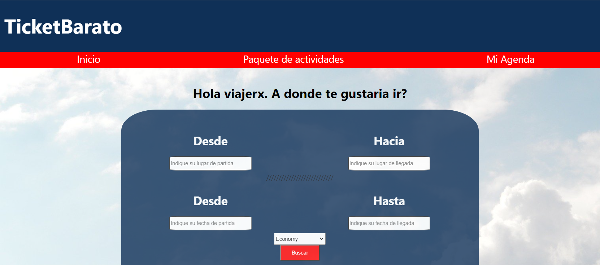

# TurismoCity
Proyecto Final Grupal. Consiste en una Web App de consulta y adquisición de vuelos, paquetes y actividades de turismo.

# Funciones
Hacer que el usuario pueda acceder a los viajes más accesibles según su punto de partida y destino. Como también agendarse paquetes para comprar en el futuro. Podrá calificar actividades ya realizadas con posibilidad de comentar y subir una foto tomada en su estadía.

# Características
Consultar vuelos por origen y destino
Consultar vuelos por fecha
Consultar paquetes de actividades
Obtener info de paquetes promocionales
Guardar viajes para comprarlos en el futuro
Opinar y valorar actividades

# Realizado por
* Agustín
* Carlos
* David
* Federico
* Florencia
* Matías
* Matías
* Nadia